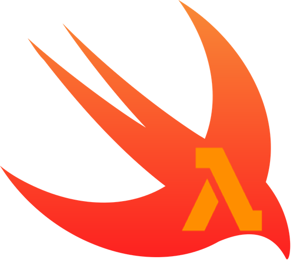

<p align="center">
  
</p>

# swiftlambda
AWS Lambda Swift functions made easy

```
➜  swiftlambda new -n MyNewLambda && cd MyNewLambda
➜  swiftlambda build
➜  swiftlambda deploy -n MyNewLambda -r arn:aws:iam::XXXXXXX:role/service-role/use-your-role
```

Just like that!

# Prerequisites

These software must be installed to use swiftlambda:
* Swift 5.3 - swiftlambda uses Swift Package Manager
* [Docker for Mac](https://docs.docker.com/docker-for-mac/install/) - used to build AWS Lambda compatible Swift binary
* [AWS CLI](https://docs.aws.amazon.com/cli/latest/userguide/install-cliv2-mac.html) - swiftlambda expects aws-cli to be installed and configured with credentials and default region

# Installation
## Using [Homebrew](https://brew.sh)
```
brew tap melonamin/formulae
brew install swiftlambda 
```

## Download pre-built  binary
You can also install swiftlambda by downloading from the [latest GitHub release](https://github.com/melonamin/swiftlambda/releases).

## Compiling from source
```
git clone https://github.com/melonamin/swiftlambda && cd swiftlambda && make clean && make install
```

# Usage
```
➜ swiftLambda
OVERVIEW: AWS Lambda Swift functions made easy

USAGE: swiftlambda <subcommand>

OPTIONS:
  --version               Show the version.
  -h, --help              Show help information.

SUBCOMMANDS:
  new                     New AWS Lambda Swift template.
  build                   Build and package Swift code for AWS Lambda deployment.
  deploy                  Deploy new AWS Lambda function.

  See 'swiftlambda help <subcommand>' for detailed help.

```

## New
Creates a boilerplate Swift package for AWS Lambda function.

```
~ swiftLambda new --help
OVERVIEW: New AWS Lambda Swift template.

USAGE: swiftlambda new --name <name> [--out <out>]

OPTIONS:
  -n, --name <name>       Name. 
  -o, --out <out>         Filepath. (default: current directory)
  --version               Show the version.
  -h, --help              Show help information.
```

Inlcludes:
* dependency to [swift-aws-lambda-runtime](https://github.com/swift-server/swift-aws-lambda-runtime)
* basic handler function

## Build 
Build Swift package in linux environment using Docker.

```
~ swiftLambda build --help
OVERVIEW: Build and package Swift code for AWS Lambda deployment.

USAGE: swiftlambda build [--source <source>]

OPTIONS:
  -s, --source <source>   Filepath to Swift Package directory. (default: current directory)
  --version               Show the version.
  -h, --help              Show help information.
```

## Deploy
Prepares an AWS Lambda package(zip archive) and uploads it to AWS, can create new or update existing lambda  functions

```
~ swiftLambda deploy --help
OVERVIEW: Deploy new AWS Lambda function.

USAGE: swiftlambda deploy [--source <source>] --name <name> [--role <role>] [--update]

OPTIONS:
  -s, --source <source>   Filepath to Swift Package directory. (default: current directory)
  -n, --name <name>       AWS Lambda name. 
  -r, --role <role>       AWS Lambda execution role. 
  -u, --update            Update existing function. 
  --version               Show the version.
  -h, --help              Show help information.
```
